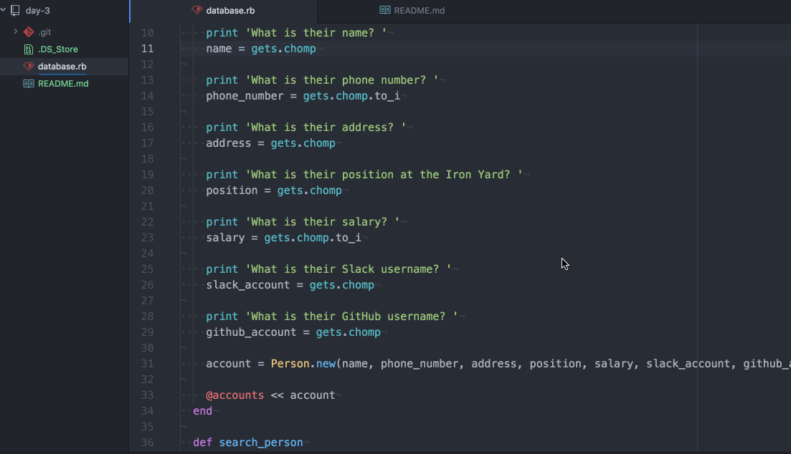

# TIY Database
## The Iron Yard Cohort 7 Week 2 Day 3

### Technology Used
  1. Atom
  2. Ruby
  3. Terminal

### Objective
You have been hired to create an app to manage information about employees.

Create an application that can add, search, and delete people from a master list.

